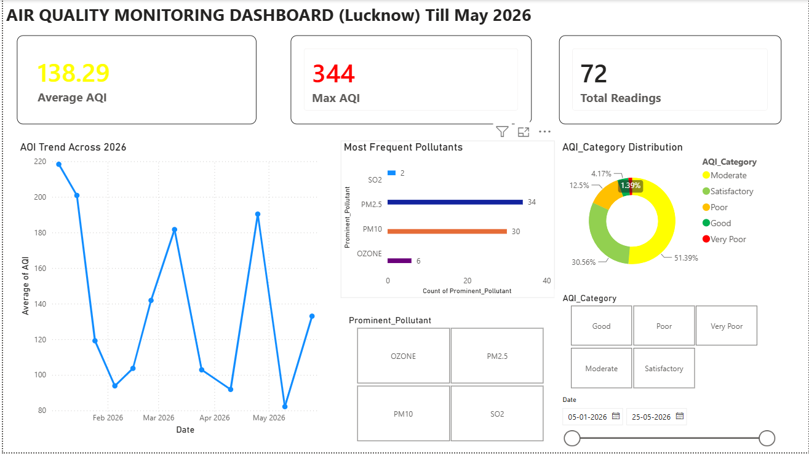
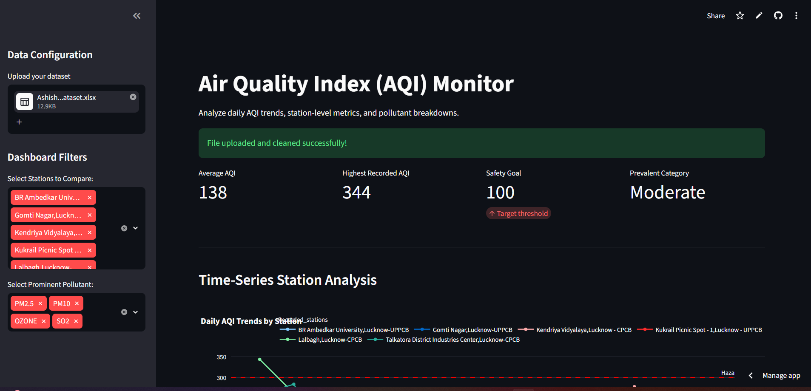
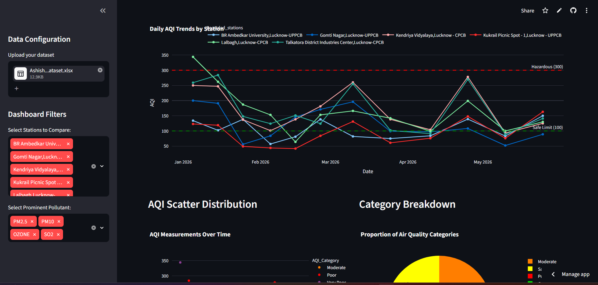

# 🌍 Lucknow Air Quality Analysis Dashboard (Jan – May)

A comprehensive data analytics project that analyzes **Air Quality Index (AQI)** data from **all six CPCB monitoring stations in Lucknow** between **January and May**. The project combines **Excel**, **Power BI**, and a **Streamlit web application** to provide interactive insights into air pollution trends, pollutant distribution, and station-wise comparisons.

---

## 📌 Project Overview

Air pollution has become one of the most critical environmental challenges in urban India. This project explores the AQI trends across Lucknow using data collected from the **Central Pollution Control Board (CPCB)** monitoring stations.

The analysis focuses on:

- 📈 Monthly AQI trends
- 📍 Station-wise AQI comparison
- 🌫️ Dominant pollutant analysis
- 🚦 AQI category distribution
- 📊 Interactive dashboards and visualizations

---

## 🎯 Objectives

- Analyze air quality trends from January to May.
- Compare pollution levels across all six CPCB stations.
- Identify the most polluted locations.
- Visualize AQI categories and pollutant distribution.
- Build an interactive dashboard for easy exploration.

---

## 📊 Data Source

- **Source:** Central Pollution Control Board (CPCB)
- **Location:** Lucknow, Uttar Pradesh
- **Duration:** January – May
- **Monitoring Stations:** 6 CPCB Stations

---

## 🛠️ Tools & Technologies

| Tool | Purpose |
|------|---------|
| 📊 Microsoft Excel | Data Cleaning & Preprocessing |
| 📈 Power BI | Interactive Dashboard |
| 🐍 Python | Data Handling |
| 🎈 Streamlit | Web Application |
| 🐼 Pandas | Data Analysis |
| 📉 Matplotlib / Plotly | Visualizations |

---

## 📁 Repository Structure

```
Lucknow-Air-Quality-Analysis/
│
├── Data/
│   └── AshishKumarMishra_CleanedDataset.xlsx
│
├── Dashboard/
│   └── Air Quality Dashboard.pbip
│
├── Streamlit_App/
│   ├── app.py
│   ├── requirements.txt
│   └── assets/
│
├── Images/
│   ├── powerbi dashboard.png
│   └── streamlit ss1.png
│   └── streamlit ss2.png   
│
├── README.md
└── LICENSE
```

---

## 📈 Dashboard Features

### Power BI Dashboard

- Monthly AQI Trend
- AQI Category Distribution
- Station-wise Comparison
- Prominent Pollutant Analysis
- Interactive Filters
- KPI Cards
- Dynamic Charts

---

## 💻 Streamlit Application Features

- Interactive Dashboard
- Station Selection
- Date Filtering
- AQI Trend Visualization
- Category Analysis
- Pollutant Insights
- Responsive User Interface

---

## 📊 Power BI Dashboard



## 🌐 Streamlit App

### Home Page


### Analysis Page


### Streamlit Application


https://ash972-cpu-air-quality-analysis-app-4dqo9b.streamlit.app/


---

## 📊 Key Insights

- Comparison of AQI across six CPCB monitoring stations.
- Identification of pollution hotspots.
- Monthly variation in air quality.
- Dominant pollutant analysis.
- Interactive exploration through dashboards.

---

## 📌 Skills Demonstrated

- Data Cleaning
- Exploratory Data Analysis (EDA)
- Data Visualization
- Dashboard Development
- Business Intelligence
- Python Programming
- Streamlit Development
- Power BI
- Excel Analytics

---

## 📄 Future Improvements

- Add real-time CPCB API integration.
- Extend analysis for the entire year.
- Weather correlation analysis.
- AQI prediction using Machine Learning.
- Deploy the Streamlit app on Streamlit Cloud.

---

## 🤝 Contributing

Contributions, issues, and feature requests are welcome.

Feel free to fork this repository and submit a pull request.

---

## 📜 License

This project is licensed under the MIT License.

---

## 👨‍💻 Author

**Ashish Kumar Mishra**

- B.Tech CSE (Data Science)
- Data Analytics | Power BI | Python | Streamlit

If you found this project helpful, don't forget to ⭐ the repository!
